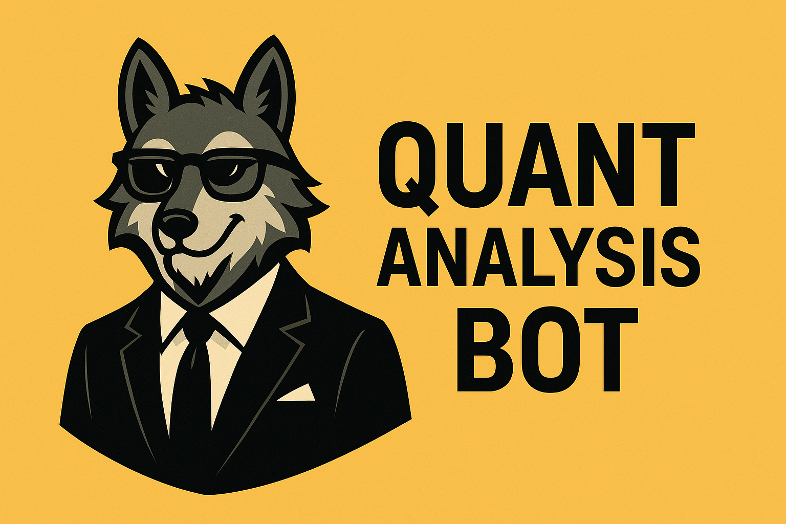

# 🐺 Quant Wolf — The Ultimate Discord Trading Signals Bot  

  

[](https://github.com/your-username/quant-wolf-discord-bot/stargazers)  
[](https://github.com/your-username/quant-wolf-discord-bot/network/members)  
[](https://github.com/your-username/quant-wolf-discord-bot/issues)  
[](LICENSE)  

---

## 🔥 What is Quant Wolf?  

**Quant Wolf** is not just another bot — it’s your **personal Wolf of Wall Street inside Discord**.  
Built for **retail traders, quant enthusiasts, and finance communities**, it delivers **real-time stock insights, technical analysis, and market news**, all wrapped in a slick Discord interface.  

💡 Imagine a bot that:  
- 📊 Gives **live NSE & global stock prices** in seconds  
- 🔍 Runs **professional-grade technical analysis** (SMA, EMA, RSI, MACD, Volume)  
- 📰 Filters **market-moving news** with your custom keywords  
- 🐺 Manages a **community trading watchlist** for your server  
- 📈 Lets you **backtest strategies** with real market data  

No spam. No hype. Just **clean signals**.  

---

## ✨ Core Features  

| ⚡ Feature | 🛠️ Command | 📖 What It Does |
|------------|------------|-----------------|
| 💰 **Live Pricing** | `/price <ticker>` | Instantly fetches the latest stock price |
| 📊 **TA Snapshot** | `/signal <ticker>` | Runs SMA, EMA, RSI, MACD, and Volume checks |
| 📰 **News Alerts** | `/keywords add <word>` | Triggers alerts on earnings, deals, or keywords you track |
| 👀 **Smart Watchlist** | `/watch list` | Share & manage NSE tickers as a community |
| 📅 **Holiday Mode** | `/holidays add <date>` | Bot auto-pauses on NSE trading holidays |
| 📈 **Backtesting Engine** | `/backtest <ticker> <start> <end>` | Test strategies with CAGR, win rate & drawdown |

---

## 🎥 Demo Preview  

*(Add screenshots or GIFs of `/price`, `/signal`, `/backtest` here)*  
Example:  
  

---

## ⚡ Quick Setup  
```bash
Clone the repo:  

git clone https://github.com/your-username/quant-wolf-discord-bot.git
cd quant-wolf-discord-bot
Install dependencies:

pip install -r requirements.txt


Configure your .env:

DISCORD_TOKEN=your_discord_bot_token
FINNHUB_TOKEN=your_finnhub_api_key
MARKETAUX_TOKEN=your_marketaux_api_key
SIGNALS_CHANNEL_NAME=signals
ENABLE_PAPER=0


Run the bot:

python bot.py

🧠 Tech Stack

Python 3.11+ 🐍

discord.py 💬

pandas + yfinance 📊

aiosqlite 🗄️

Finnhub + MarketAux APIs 🌍

🐺 Vision

“Trading isn’t about hype — it’s about signals.
Quant Wolf is your disciplined, data-driven wolfpack inside Discord.”

🤝 Contribute

We welcome pull requests and ideas. Join the pack — improve strategies, add new indicators, or extend integrations.

📜 License

Licensed under the MIT License. Free to use, modify, and improve.

🔖 GitHub Topics

discord-bot trading-bot quant stock-market nse finance technical-analysis ai-trading
